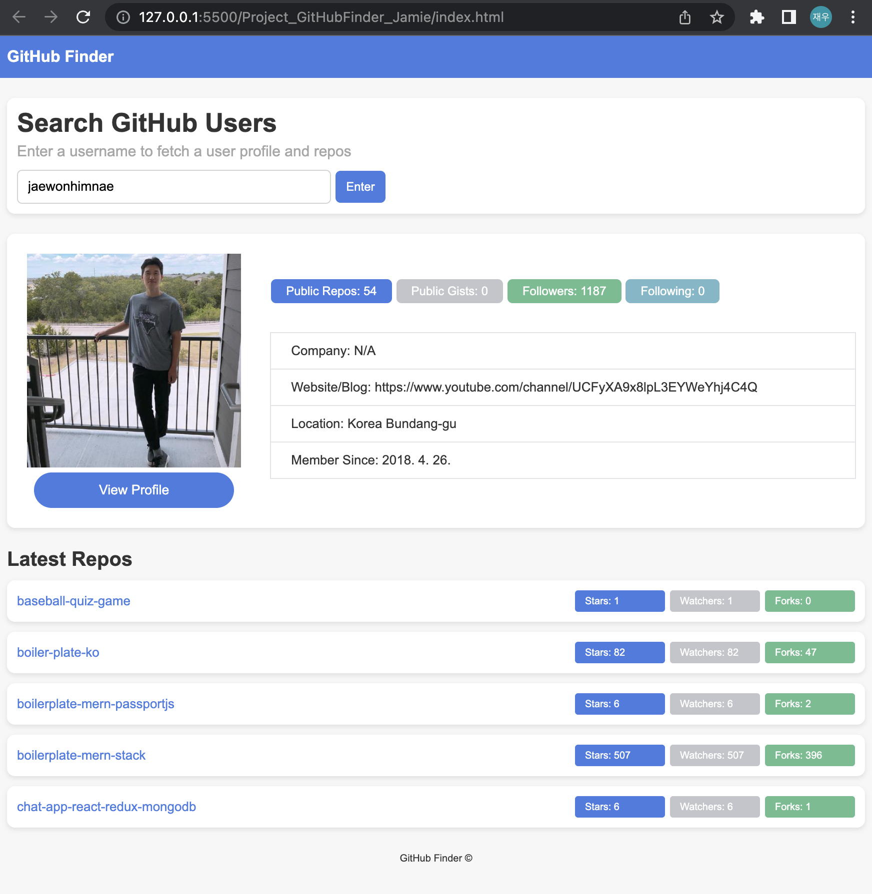

# GitHub Finder 🔍 🐱
> 해당 레포지토리는 교육용으로 만들어졌으며 어떠한 상업적 용도를 취하지 않습니다.

GitHub Finder는 GitHub 사용자를 손쉽게 찾을 수 있게 도와주는 도구입니다! 사용자 이름을 입력하면 해당 사용자의 상세 프로필과 리포지토리 정보를 볼 수 있습니다.

## 주요 기능 🌟

### 1️⃣ 로컬 스토리지를 이용한 데이터 유지 💾

사용자의 검색 정보는 로컬 스토리지에 저장되어 페이지를 새로고침해도 데이터가 유지됩니다.

```javascript
localStorage.setItem('githubUsername', username);
```

이 코드는 로컬 스토리지에 사용자 이름을 저장하는 방법을 보여줍니다. 페이지를 새로 고침하거나 재 방문해도 마지막으로 검색한 사용자의 정보가 보존되어 바로 해당 사용자의 데이터를 불러올 수 있습니다.

---

### 2️⃣ 헤더 클릭으로 초기 상태로의 복귀 🔙

헤더를 클릭하면 웹 애플리케이션의 상태가 초기화되어, 모든 로컬 스토리지 데이터가 클리어되고 처음 상태로 돌아갈 수 있습니다.

```javaScript
headerTitle.addEventListener('click', () => {
    localStorage.removeItem('githubUsername');
    window.location.reload();
});
```
이 기능은 사용자가 언제든지 새로운 검색을 쉽게 시작할 수 있도록 도와줍니다.

---

### 3️⃣ 검색 히스토리 기능 🕰️
검색창에는 최근 검색한 사용자 이름이 최대 5개까지 나열됩니다. 이전에 검색했던 사용자를 쉽게 다시 찾을 수 있도록 도와줍니다.

```javaScript
function saveToHistory(username) {
/* - 사용자 이름을 로컬 스토리지에 저장하고 검색 히스토리를 업데이트합니다. - */
  let usernames = JSON.parse(localStorage.getItem('usernameHistory')) || [];
    /* - 저장된 사용자 이름 목록을 가져옵니다. - */
  if (!usernames.includes(username)) {
    /* - 새 사용자 이름이 목록에 없으면 추가합니다. - */
    usernames.push(username);
    localStorage.setItem('usernameHistory', JSON.stringify(usernames));
  } /* - 사용자 이름 목록을 로컬 스토리지에 저장합니다. - */
}
```

위 코드는 사용자가 검색한 기록을 로컬 스토리지에 저장하고, 이를 검색창에 표시하여 이전 검색 내역에 빠르게 접근할 수 있도록 해줍니다.

<br>

### 🖥️ 구현화면
---
<br>

[웹 사이트 미리보기](lighthearted-flan-4aded1.netlify.app)

